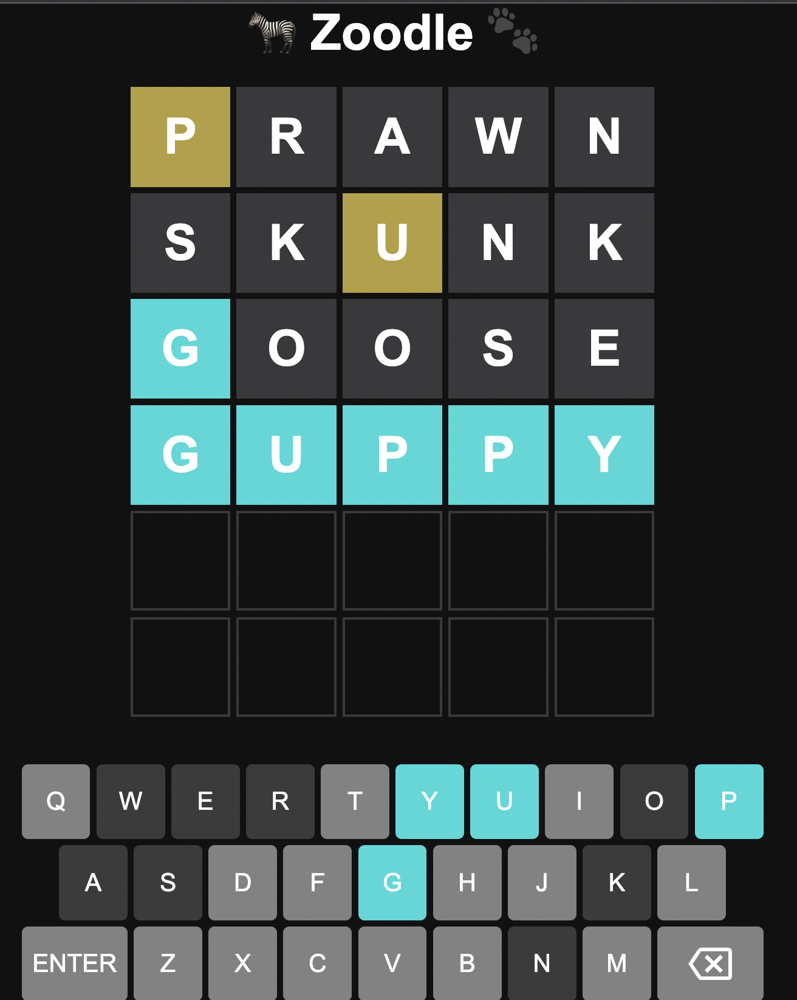

# Zoodle
## An ambitious wordle clone

### How to play
Using either the keyboard on your machine or by clicking the on screen keyboard, enter your guess.  
All guesses must be 5 letter animals.  
If a word is not in the list the app will show an alert.  
Letters that are not in the word will grey out, letters in the wrong location will turn yellow and correct ones blue.  
You get 6 attempts before a loss or win. You can play again using the button in the top right of the app.

### File structure
dictionary.js - A list of words that will be accepted as viable guesses  
index.html - Dictates the elements that appear on screen  
script.js - controls the back end logic of the app  
styles.css - controls how the elements and the page actually look  
targetWords.json - A list of words that will actually be used as answers  

### Description

With this project, I am trying to create a clone of wordle.  

This project has been built using only basic HTML, CSS and Javascript.  

As it is a single page application, I did not feel the need to impliment any additional frameworks.  

The basic idea will be that it should function just as Wordle does but with the twist that all of the acceptable answers will be animals.
